# Guía de demostración de PIKAS

> **Milestone local 0.6.0:** POS guiado, búsqueda por nombre, recargas independientes, límites diarios por estudiante, política de caja y reembolsos vinculados. Implementación demo verificada localmente. Consulta [POS y modelo financiero](POS_FINANCIAL_MODEL.md) para comportamiento vigente, límites y pasos productivos. Las secciones 0.5.x siguientes conservan contexto histórico y no sustituyen esta actualización.

| Dato | Valor |
| --- | --- |
| Versión | 2.0 para PIKAS 0.6.0 |
| Última verificación | 22 de septiembre de 2026 |
| Rama | `main` |
| Fuente de capturas | Capturas históricas 0.5.x; pruebas 0.6 locales en 390/768/1440 px |
| URL pública | Sin cambios; no se desplegó 0.6.0 |
| Duración | 12–15 minutos |

PIKAS demuestra experiencias interconectadas para Familia, Estudiante, Cafetería/POS, Administración escolar y Administración de cafetería. **Todo nombre, escuela, cuenta, restricción y transacción mostrado aquí es ficticio.**

## 1. Preparación

1. Define `NEXT_PUBLIC_PIKAS_DEMO_MODE=true`, ejecuta `npm run dev` y abre `http://localhost:3000`.
2. Usa el mismo perfil/origen para demostrar propagación y persistencia entre roles.
3. Cierra sesión antes de cambiar de rol.
4. Si necesitas la línea base, pulsa **Restablecer demo** en un resumen administrativo o ejecuta:

```js
localStorage.removeItem("pikas:unified-demo:v2");
location.reload();
```

Una recarga normal conserva el estado. Otro navegador, perfil, dispositivo u origen no comparte los cambios.


## Recorrido 0.6.0

1. POS → Usuario PIKAS → busca `Sof` y selecciona Sofi, o verifica `PK-10982`. Desconocidos y escuelas no conectadas no aparecen.
2. Añade Pasta con pollo → Continuar al pago → Saldo PIKAS → Confirmar venta. Ver recibo y Nueva transacción vuelven al inicio.
3. No usuario → Pizza escolar → Buscar usuario PIKAS → Sofi. El carrito conserva Pizza y muestra bloqueo por Lactosa. Cambia a Mateo para repetir validación.
4. No usuario → Pasta → pago → introduce 100: falta efectivo. Introduce 1000: cambio RD$820. No hay pago dividido. Calculadora en Herramientas no cambia ningún importe.
5. Tras una compra de Sofi, otra Pasta supera su límite diario. Familia → Estudiantes → Sofi permite ajustar o apagar solo su límite. Mateo mantiene el suyo.
6. Herramientas → Recargar saldo con usuario identificado. La recarga aparece como otro evento y no restaura capacidad diaria. Para demostrar saldo insuficiente, usa un snapshot ficticio con saldo RD$1, manteniendo el límite suficiente; el pago muestra saldo, total y faltante.
7. Transacciones permite investigar por ID/nombre/código, fecha y cajero. Refrescar conserva ventas y eventos; el carrito requiere nueva identificación.
8. Cafetería Admin → Configuración POS: apaga ventas del turno. POS deja de mostrarlas, pero reportes y compras las conservan.
9. Reembolsos de caja inicialmente apagados. Actívalos y desactiva aprobación para permitir caja; habilita parcial si necesitas RD$100 de una compra RD$180. Con aprobación ON, el administrador debe procesar el reembolso desde Transacciones.
10. Familia → Movimientos → abre Reembolso: muestra destino, compra original, motivo, procesador y aprobador cuando corresponde.
11. Reembolso del mismo día restaura gasto diario; uno de compra anterior solo devuelve fondos. Pruebas unitarias cubren el límite de medianoche de Santo Domingo.
12. Cafetería Admin → Configuración POS → Cargar historial de recomendaciones agrega diez productos y compras ficticias de hace 2 y 40 días, sin cambiar saldo/gasto de hoy. Identifica Sofi en POS para ver ambos grupos de cinco. Top 5 se forma solo con compras registradas. Sin historial, aparece “Sin historial suficiente”; compra productos elegibles para poblar cafetería. La ventana de 90 días del cliente puede aportar cinco distintos del top de 30 días.
13. Desconecta red: Offline bloquea nuevas operaciones; reconectar vuelve a comprobar almacenamiento. Las solicitudes familiares permanecen desactivadas.

Las capturas históricas anteriores son de 0.5.x; no representan la nueva disposición de caja.

## Capturas actuales

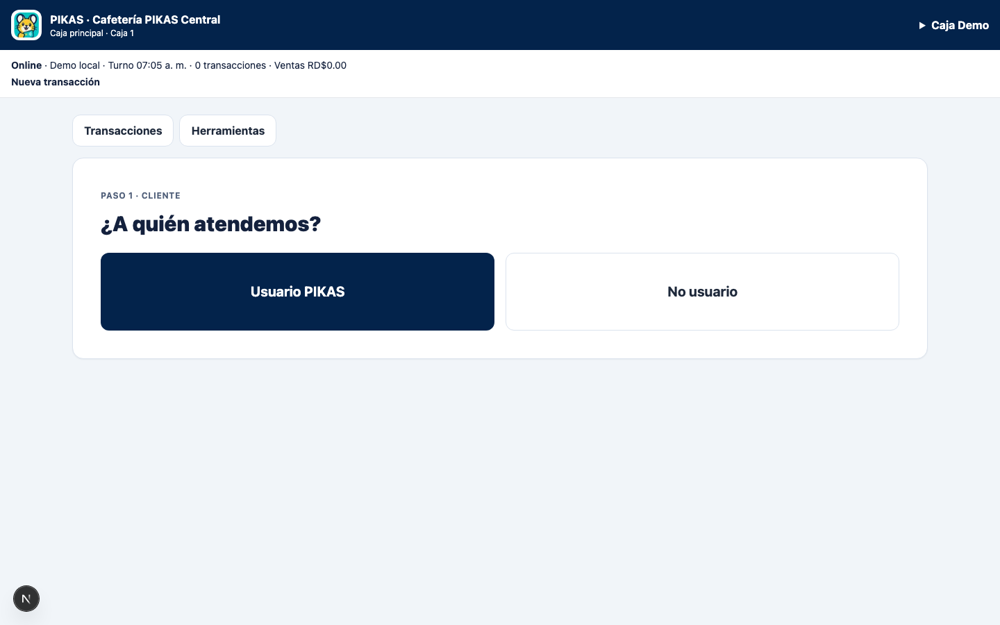

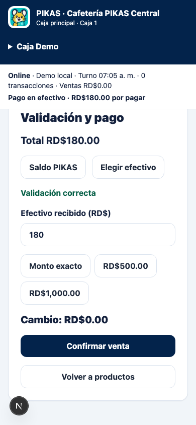

## Referencias visuales históricas (0.5.x)

Las secciones siguientes preservan las capturas y el recorrido anterior. El recorrido 0.6.0 de arriba define el comportamiento vigente.

## 2. Cuentas demo

| Experiencia | Identificador | Contraseña/PIN | Entrada | Resultado |
| --- | --- | --- | --- | --- |
| Familia | `familia@demo.pikas.do` | `pikas-demo` | `/login` | `/familias` |
| Estudiante | `PK-10982` | `pikas-demo` | `/login` | `/estudiante` |
| Cafetería/POS | `cafeteria@demo.pikas.do` | `pikas-demo` | `/login` | `/pos` |
| Admin escolar | `admin.escuela@demo.pikas.do` | `pikas-demo` | `/admin/login` | `/admin/escuela` |
| Admin cafetería | `admin.cafeteria@demo.pikas.do` | `pikas-demo` | `/admin/login` | `/admin/cafeteria` |

No uses credenciales reales. “Caja Patio” aparece suspendida para revisar estados y no es una cuenta de acceso. `PK-11804` identifica a Mateo en POS, pero no es un login estudiantil.

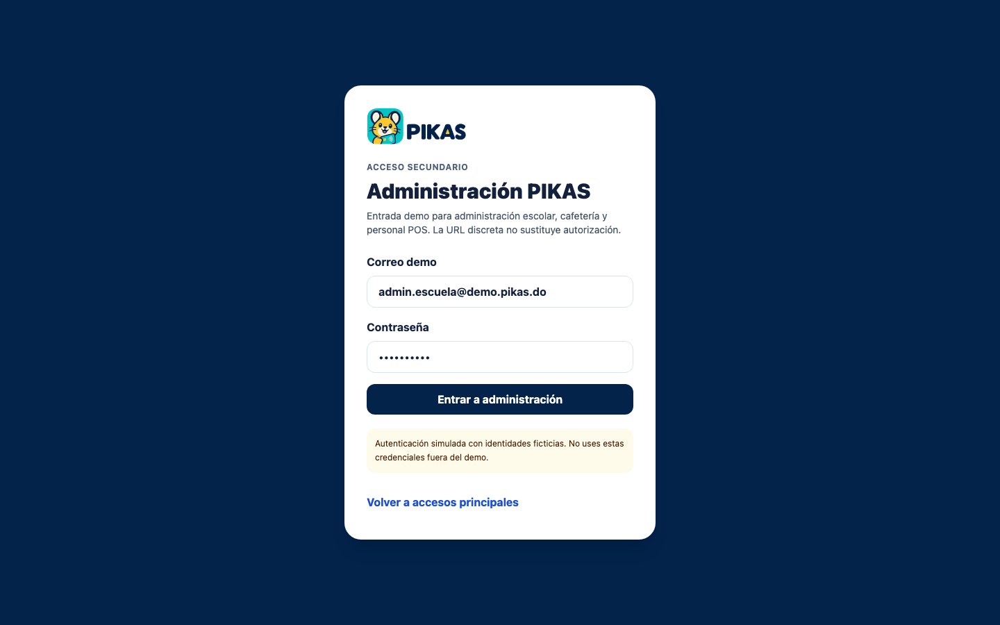

## 3. Administración escolar

1. Entra como `admin.escuela@demo.pikas.do`.
2. En **Resumen**, confirma estudiantes activos/archivados, conexiones activas y actividad reciente.
3. En **Estudiantes**, busca “Sofi”. El código debe estar enmascarado; prueba Archivar/Activar, Regenerar código o Restablecer acceso. Ninguna acción revela una contraseña.
4. En **Importar CSV**, previsualiza una fila válida y otra con `PK-10982`: la segunda debe rechazarse como duplicada.
5. En **Administradores**, invita una cuenta demo, cambia estados y confirma que el último administrador escolar activo no puede suspenderse.
6. En **Cafeterías conectadas**, observa conexiones activa, pendiente y suspendida. Solo Escuela puede aprobar, rechazar, suspender o revocar.
7. En **Actividad**, confirma que las mutaciones importantes producen un evento.

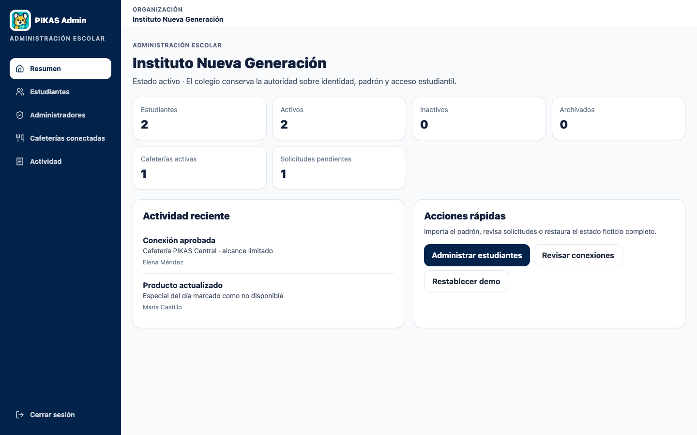

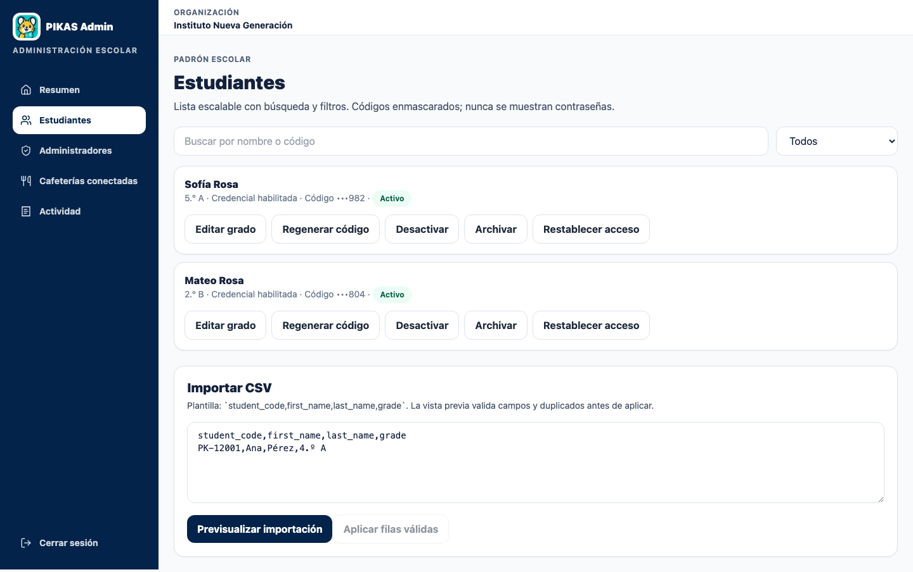

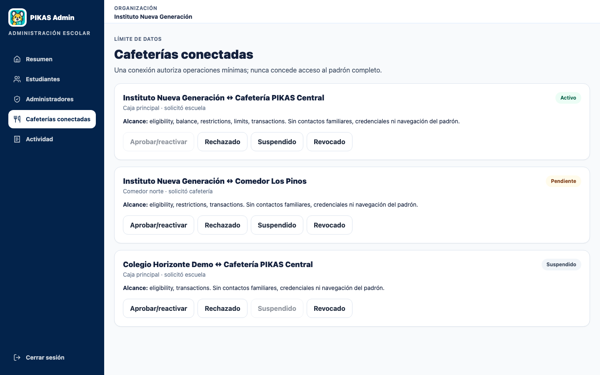

## 4. Administración de cafetería

1. Cierra sesión y entra como `admin.cafeteria@demo.pikas.do`.
2. En **Resumen**, confirma disponibilidad, personal POS y conexiones.
3. En **Menú y productos**, marca un producto no disponible o aumenta su precio RD$5.
4. En **Personal de caja**, invita una cuenta, revisa Caja Demo activa y Caja Patio suspendida, y cambia un estado.
5. En **Escuelas conectadas**, Cafetería puede solicitar una conexión pendiente, pero no aprobarla.
6. En **Transacciones**, comprueba que solo se expone contexto mínimo de compra.

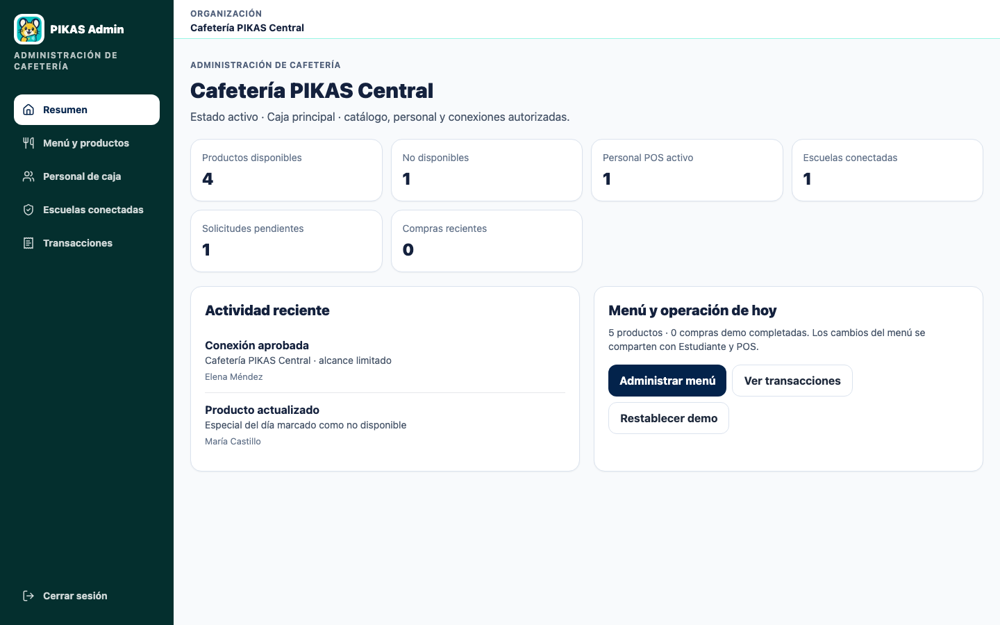

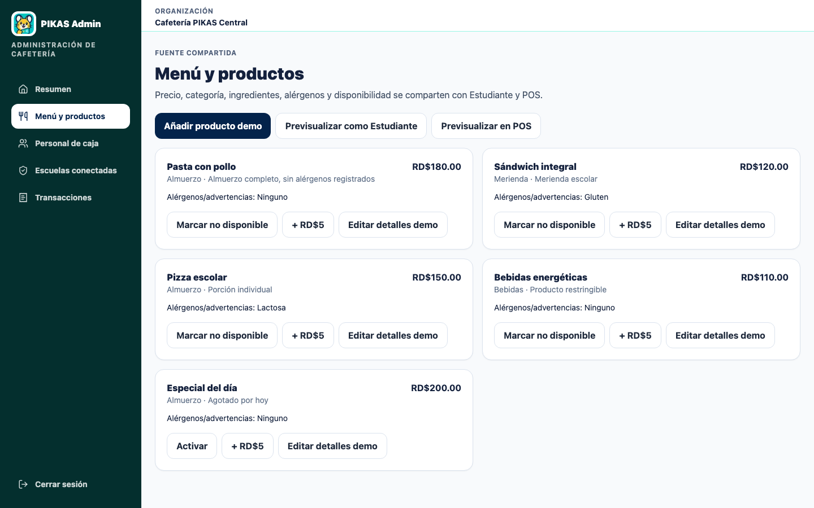

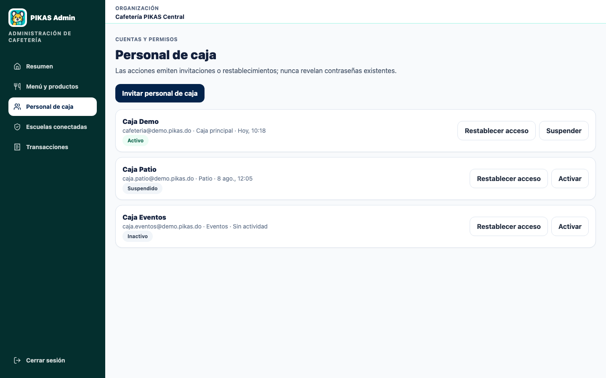

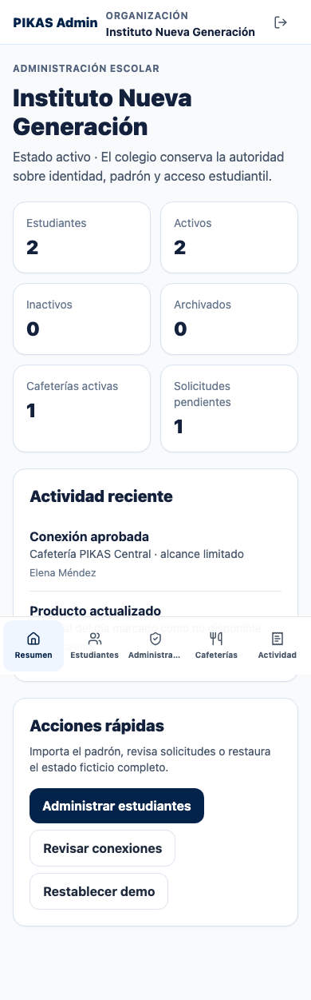

## 5. Propagación entre experiencias

Los cambios administrativos usan el mismo estado ficticio que las experiencias existentes:

- disponibilidad/precio del menú cambia en Estudiante y POS;
- archivar o regenerar un estudiante afecta su lookup POS;
- suspender/revocar la conexión activa bloquea lookup/checkout;
- suspender Caja Demo bloquea operación POS;
- una compra POS actualiza saldo e historial de Estudiante y Familia.

Restaura el demo antes del checkout si modificaste la conexión, Caja Demo, Sofi o Pasta con pollo.

## 6. Familia y Estudiante

En Familia, revisa estudiantes, saldo, límites, restricciones, movimientos y preórdenes. En Estudiante, comprueba dashboard, navegación, menú, **Mis compras**, presupuesto y perfil. Pizza escolar debe advertir Lactosa para Sofi; Bebidas energéticas debe permanecer bloqueada.


## 7. Cafetería/POS y checkout

1. Entra como `cafeteria@demo.pikas.do`.
2. `PK-00000` debe fallar sin mostrar datos.
3. `PK-10982` debe devolver Sofi con saldo, límites, alergias y bloqueos mínimos.
4. Pizza escolar y Bebidas energéticas no deben añadirse. Pasta con pollo sí.
5. Confirma y completa una sola compra.
6. Recarga `/pos`; el historial debe conservarla.
7. Cambia a Estudiante y Familia en el mismo perfil; la compra y el saldo actualizado deben aparecer.

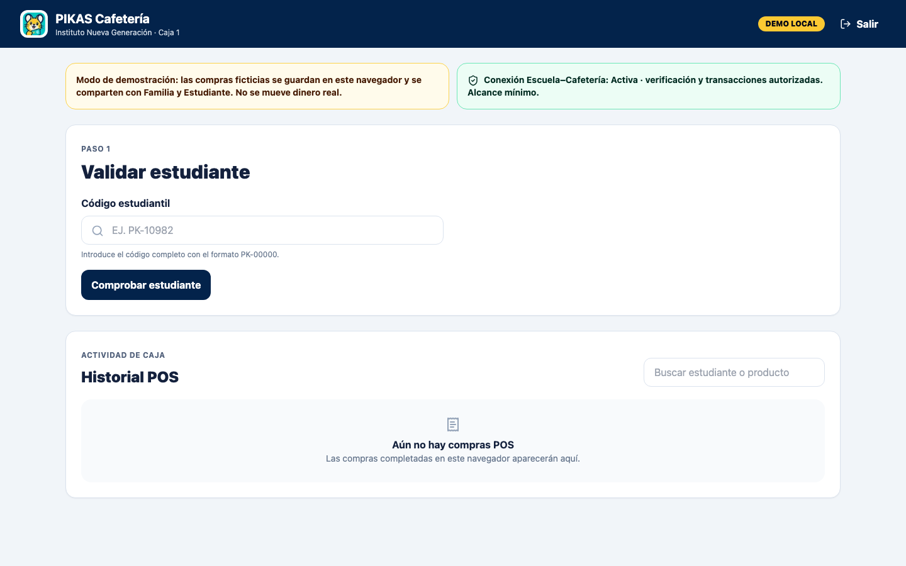


## 8. Fronteras de acceso esperadas

- Familia y Estudiante no pueden abrir `/pos` ni `/admin/*`.
- POS no puede abrir Familia, Estudiante ni Administración.
- Admin escolar no puede abrir el espacio de Admin cafetería; se redirige al propio.
- Admin cafetería no puede abrir el espacio escolar; se redirige al propio.
- Cafetería no puede editar padrón, identidades o contactos familiares.
- Escuela no puede administrar el catálogo o personal POS.

## 9. Solución de problemas

| Problema | Resolución |
| --- | --- |
| Rol equivocado | Cierra sesión, vuelve a la entrada correcta y autentica de nuevo. |
| Estado alterado | Usa **Restablecer demo** o elimina `pikas:unified-demo:v2`. |
| Lookup POS falla para Sofi | Reactiva Sofi, Caja Demo y la conexión `Instituto Nueva Generación ↔ Cafetería PIKAS Central`. |
| Producto no coincide | Restaura el demo; Administración de cafetería puede haber cambiado precio/disponibilidad. |
| Compra no aparece en otro rol | Usa el mismo perfil/origen y confirma que el checkout terminó. |
| Imagen rota en GitHub | Verifica ruta relativa y capitalización exacta bajo `docs/assets/demo-guide/`. |

## 10. Limitaciones

Administración 0.5.3, sesiones, reportes y conciliación son demo local. No hay binding administrativo Supabase completo, invitaciones por correo, importación CSV productiva, sincronización entre dispositivos, SIS, QR verificable, búsqueda POS por nombre, pagos reales ni refunds/reversos operativos. La URL pública puede corresponder a una versión anterior hasta verificarse.

Mantén esta guía sincronizada cuando cambien versión, rutas, etiquetas, credenciales, códigos, permisos, persistencia o capturas.
# Nota 0.5.1

Las cuentas existentes siguen usando la contraseña demo documentada en la interfaz. En Supabase, créelas solo en desarrollo con `PIKAS_DEMO_PASSWORD` y `npm run seed:supabase-auth`: `admin.escuela@demo.pikas.do` → `/admin/escuela`, `admin.cafeteria@demo.pikas.do` → `/admin/cafeteria`, y `cafeteria@demo.pikas.do` → `/pos`. Logout elimina la sesión; las cookies permiten conservarla tras refrescar.

## Flujo 0.5.2

Cambie un producto en Cafetería y actualice Estudiante, Familia o POS para observar la misma disponibilidad. En POS elija “Código estudiantil / NFC” para aplicar saldo, alergias y bloqueos, o “Venta en efectivo” para no afectar balances. El carrito se conserva al refrescar. Una imagen rota muestra iniciales con texto accesible.

## Flujo 0.5.3

PIKAS es diseñada y desarrollada por Palmchat Innovations LLC; la atribución aparece en landing y accesos. En POS elija **Ventas PIKAS**, **Venta asociada a estudiante** o **Venta general en efectivo**. La venta general no pide estudiante ni aparece en historiales familiares. En Administración de cafetería revise filtros, exporte CSV y compare el cierre esperado con un conteo manual opcional. Ninguna venta convierte efectivo en crédito PIKAS automáticamente.
