# Guía de demostración de PIKAS

| Dato | Valor |
| --- | --- |
| Versión de la guía | 1.2 para PIKAS 0.4.0 |
| Última verificación | 11 de agosto de 2026 |
| Código verificado | Árbol de trabajo local sin commit, basado en `1c93c15` |
| Rama | `feature/unified-pikas-app` |
| Capturas | Aplicación local en demo mode, `http://localhost:3000` |
| URL aplicable | 0.4.0: `http://localhost:3000`; el [sitio público](https://pikas-demo.vercel.app) conserva la versión desplegada anterior a estos refinamientos |
| Duración estimada | 8–12 minutos |

PIKAS demuestra una experiencia escolar compartida para Familia, Estudiante y Cafetería/POS: controles familiares, saldo y límites, catálogo, restricciones alimentarias y una compra visible entre roles. **Todas las cuentas, estudiantes, escuelas, restricciones y transacciones de esta guía son ficticias.** No introduzcas información real.

> El sitio público [pikas-demo.vercel.app](https://pikas-demo.vercel.app) contiene el POS funcional y demo auth autorizada. Para presentar la identidad visual 0.4.0, usa el checkout local hasta que exista una publicación posterior autorizada.

## 1. Antes de comenzar

- Usa Chrome, Edge o Chromium reciente. Safari/WebKit también está cubierto por las pruebas móviles.
- Inicia la aplicación desde la raíz con `NEXT_PUBLIC_PIKAS_DEMO_MODE=true npm run dev` y abre `http://localhost:3000`.
- Usa **un mismo perfil y origen del navegador** para enseñar cómo una compra aparece entre POS, Estudiante y Familia. Perfiles o ventanas privadas separados mantienen estados demo separados y no compartirán la nueva transacción.
- La compra sobrevive una recarga en el mismo navegador. No se comparte con otro navegador, perfil, dispositivo u origen porque el estado vive en `localStorage`.
- Cerrar sesión antes de cambiar de rol evita sesiones obsoletas. Una cookie demo de rol dura hasta ocho horas.
- Para comenzar limpio, ejecuta el proceso de [reinicio](#8-reinicio-y-repetibilidad-del-demo) antes de iniciar el recorrido.

Limitaciones principales: el login demo selecciona un rol, no valida una cuenta real; no hay Supabase vivo, Admin, lectura QR, búsqueda por nombre, reversos ni refunds. Local es la variante verificada para la interfaz 0.3.0; el POS funcional también está disponible en el demo público anterior.

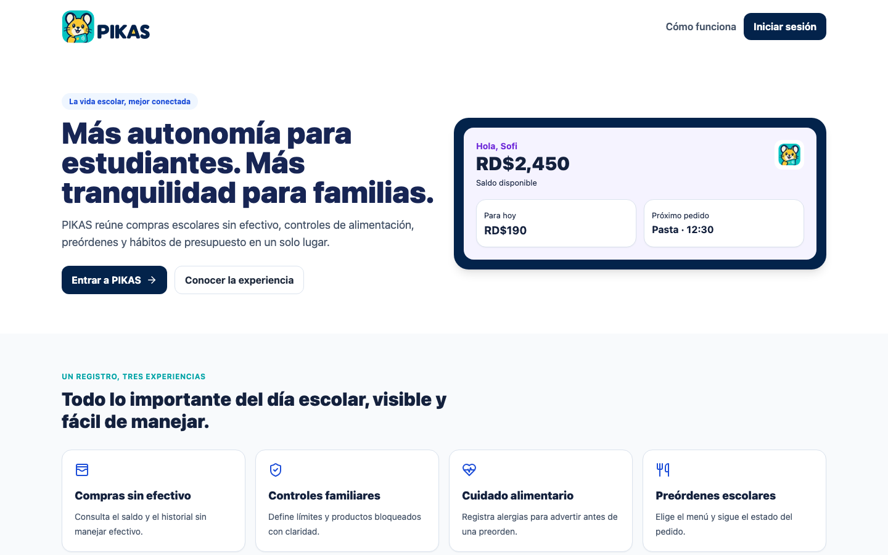

Selecciona **Entrar a PIKAS** para abrir el selector de rol.


## 2. Inicio rápido

| Experiencia | Método de acceso | Cuenta o código demo | Qué demostrar | Entorno |
| --- | --- | --- | --- | --- |
| Familia | Correo y contraseña | `familia@demo.pikas.do` / `pikas-demo` | Estudiantes vinculados, saldo, controles y movimientos | Local funcional; demo público funcional con la interfaz anterior |
| Estudiante | Código y PIN | `PK-10982` / `pikas-demo` | Saldo, presupuesto, menú y compras | Local funcional; acceso básico disponible en producción |
| Cafetería/POS | Correo y contraseña | `cafeteria@demo.pikas.do` / `pikas-demo` | Lookup, restricciones, carrito, checkout e historial | Local 0.3.0 y demo público funcional |
| Administración | No disponible | No disponible | Placeholder de una fase futura | No disponible |

Códigos POS públicos y verificados: `PK-10982` muestra a Sofi; `PK-11804` muestra a Mateo; `PK-00000` se rechaza. El PIN solo está publicado para el acceso estudiantil de Sofi. Estas credenciales son atajos ficticios y no constituyen autenticación de producción.

## 3. Ruta sugerida de presentación

1. Presenta la página inicial y entra a PIKAS.
2. Accede como Familia; muestra a Sofi y Mateo, saldos, límites y controles de Sofi.
3. Cierra sesión y accede como Estudiante; muestra saldo, disponible diario, menú e historial.
4. Cierra sesión y accede como Cafetería.
5. Prueba `PK-00000` y luego valida `PK-10982`; confirma que aparece Sofi.
6. Señala saldo, límite diario, alergias y productos bloqueados.
7. Compara Pasta con pollo (permitida), Pizza escolar (lactosa), Bebidas energéticas (bloqueo familiar) y Especial del día (no disponible).
8. Añade Pasta con pollo, revisa el carrito y completa la compra.
9. Muestra el recibo y el Historial POS; recarga para comprobar persistencia.
10. Cierra sesión y vuelve a Estudiante y Familia para mostrar el mismo movimiento y el saldo actualizado.

## 4. Recorrido de Familia

1. En `/login`, elige **Familia**. Usa `familia@demo.pikas.do` y `pikas-demo`; pulsa **Entrar como familia**.
2. En Inicio, señala el saldo combinado, la alerta alimentaria y las tarjetas de Sofi y Mateo. **Recarga demo** simula un crédito sin solicitar tarjeta ni mover dinero real.
3. Selecciona **Ver** en Sofi. Revisa nombre preferido, curso, límite diario, límite por compra, alergias `Maní, Lactosa` y el bloqueo `Bebidas energéticas`. Los botones **Guardar cambios** y **Guardar controles** persisten cambios ficticios en este navegador.
4. En **Movimientos**, usa búsqueda, filtro por estudiante y filtro de estado. Después del checkout POS, debe aparecer `Pasta con pollo` para Sofi y el saldo debe bajar RD$180.
5. **Estudiantes**, **Preórdenes** y **Perfil** también son funcionales en demo, pero sus cambios no se sincronizan fuera del navegador actual.

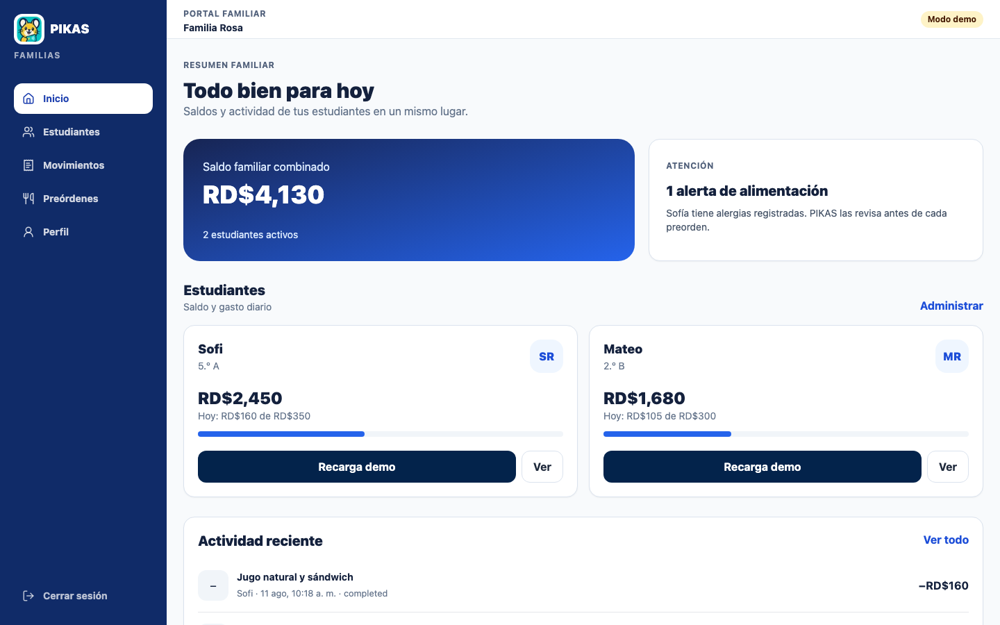

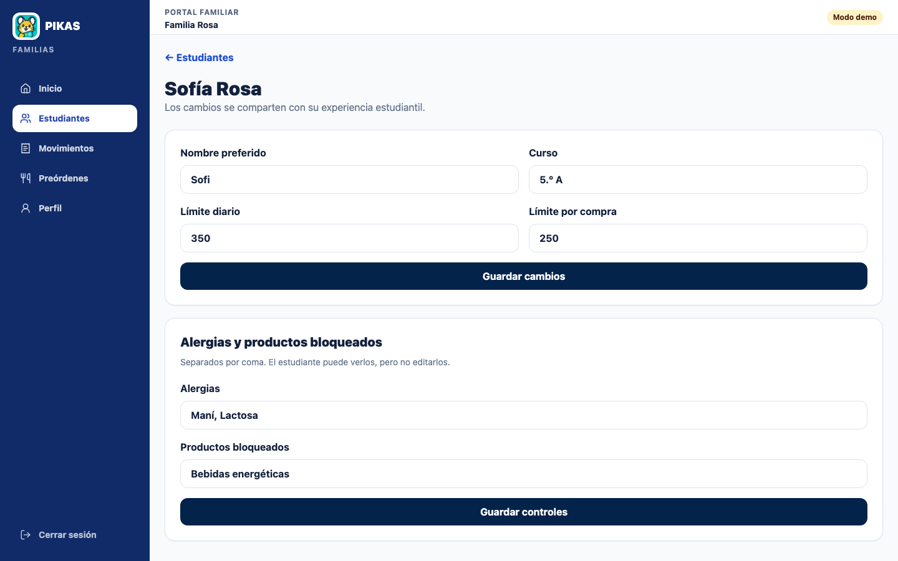

Después de la compra POS:

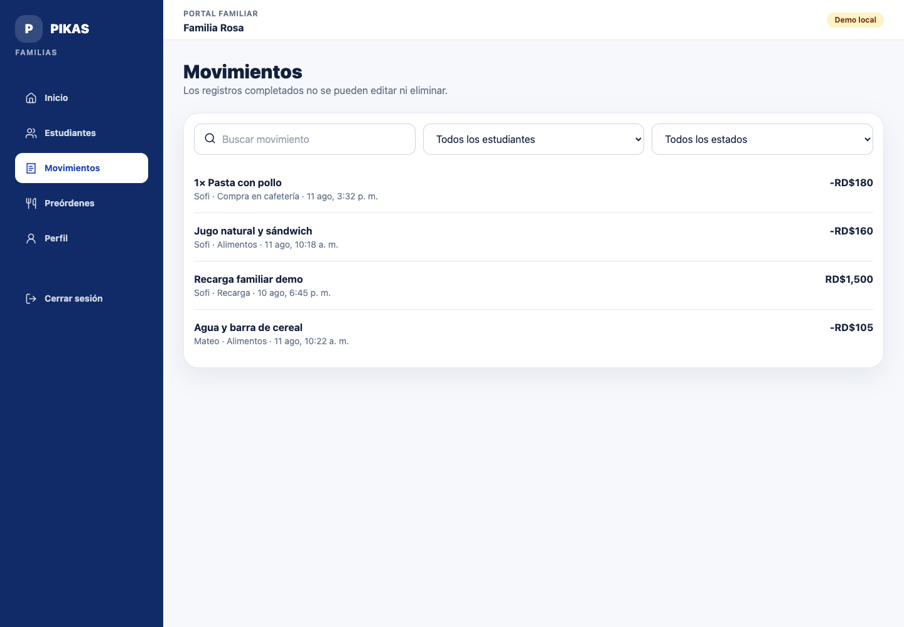

## 5. Recorrido de Estudiante

1. Cierra la sesión anterior. En `/login`, elige **Estudiante** e ingresa `PK-10982` con PIN `pikas-demo`; pulsa **Entrar como estudiante**.
2. En Inicio, señala el saldo, **Te queda hoy**, **Gastaste** y los accesos **Mi QR**, **Ver menú**, **Mis compras** y **Mi plan**.
3. En **Menú**, Pizza escolar advierte lactosa, Bebidas energéticas respeta el bloqueo familiar y Pasta con pollo está permitida. Las preórdenes son una simulación local separada del checkout POS.
4. En **Mi plan**, el estudiante puede revisar su límite y meta; no puede cambiar alergias ni controles familiares.
5. Después del checkout, abre **Mis compras** (`/estudiante/transacciones`): debe aparecer `Pasta con pollo`, estado completado, por RD$180.

La guía incluye capturas móvil y escritorio. En móvil, la navegación principal está en la barra inferior; en tablet/escritorio, permanece en un sidebar lateral.

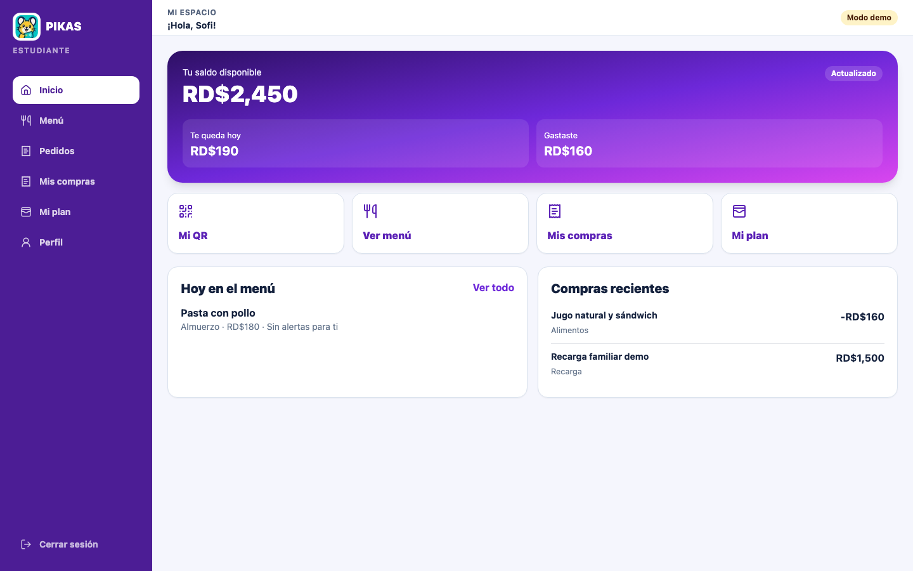

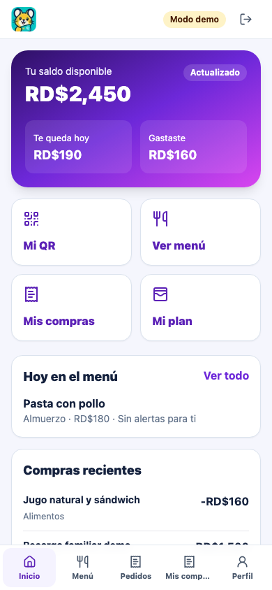

La barra permite cambiar entre Inicio, Menú, Pedidos, Mis compras y Perfil. **Mi plan** permanece como acción destacada en Inicio y destino del sidebar:


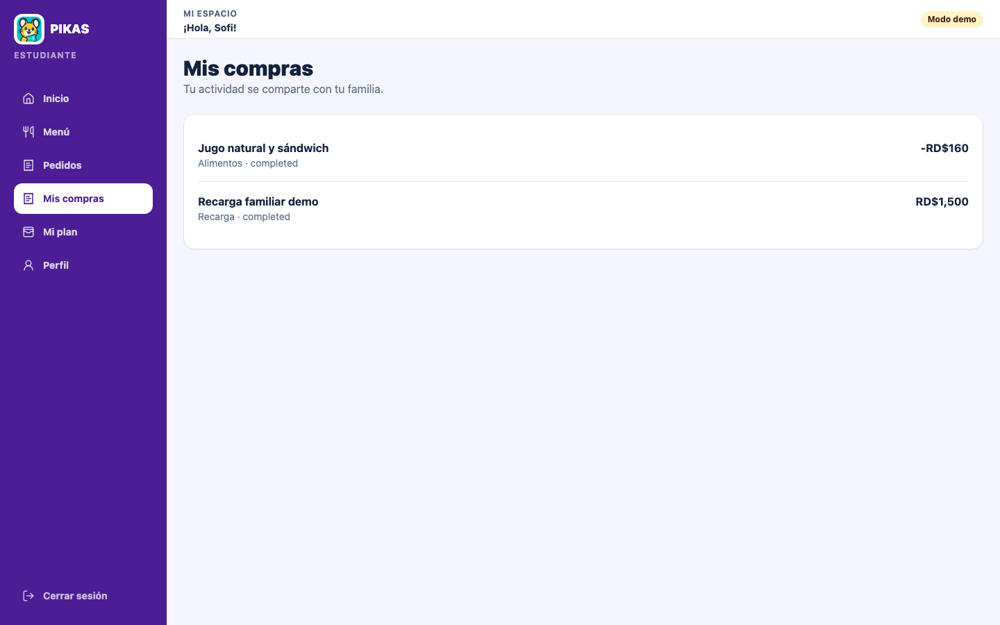

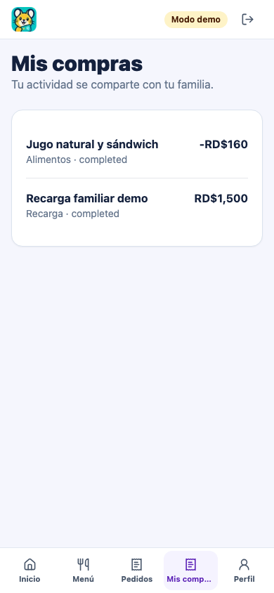

## 6. Recorrido de Cafetería/POS

1. Cierra sesión, elige **Cafetería**, usa `cafeteria@demo.pikas.do` / `pikas-demo` y pulsa **Entrar como cafetería**.

   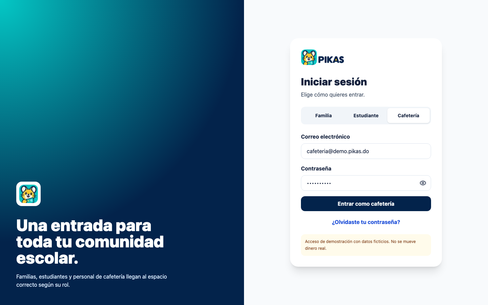

2. En **Validar estudiante**, introduce `PK-00000` y pulsa **Comprobar estudiante**. Debe aparecer un mensaje genérico de código inválido, sin revelar datos.

   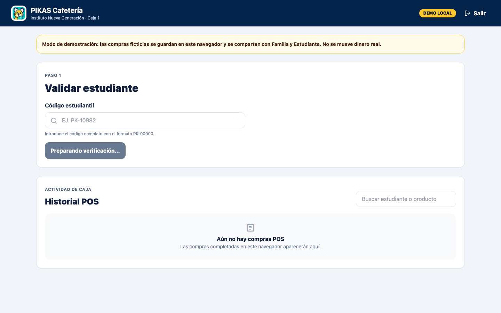

   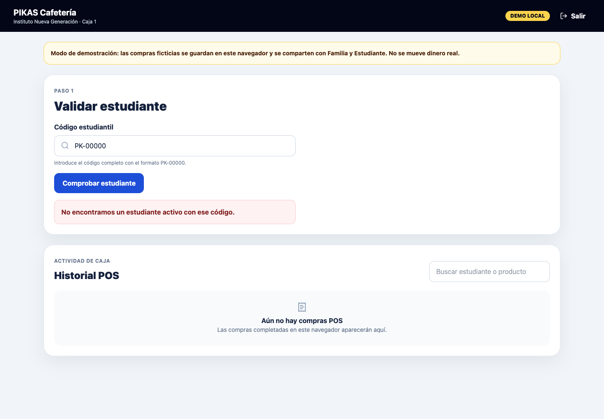

3. Sustituye el código por `PK-10982` y vuelve a pulsar **Comprobar estudiante**. Confirma **Sofi**, escuela, curso, estado activo, saldo, disponible diario, límite por compra, alergias y bloqueo familiar. `PK-11804` puede usarse en un recorrido alterno para confirmar a Mateo.

   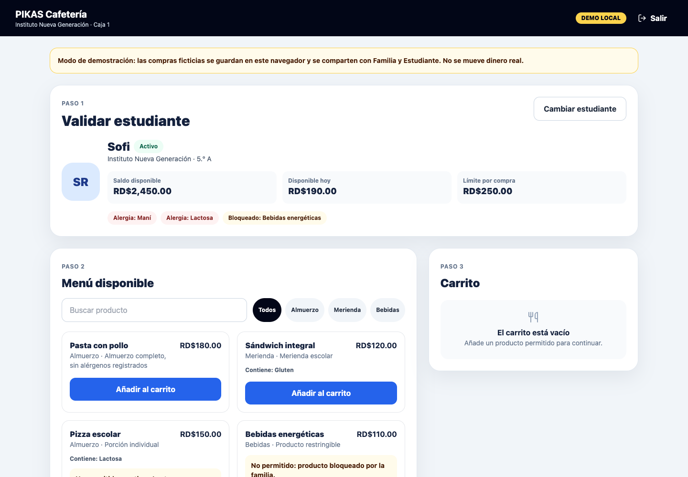

4. Revisa las reglas del catálogo:

   | Producto | Resultado para Sofi | Qué demuestra |
   | --- | --- | --- |
   | Pasta con pollo | **Añadir al carrito** disponible | Compra permitida |
   | Pizza escolar | No se puede añadir por Lactosa | Aplicación de alergia |
   | Bebidas energéticas | No se puede añadir | Bloqueo familiar |
   | Especial del día | No se puede añadir | Producto no disponible |

   

5. Pulsa **Añadir al carrito** en Pasta con pollo. Los controles **Reducir**, **Aumentar** y **Quitar** ajustan el carrito; **Vaciar carrito** lo descarta sin crear un movimiento. Mantén una unidad y revisa RD$180.

   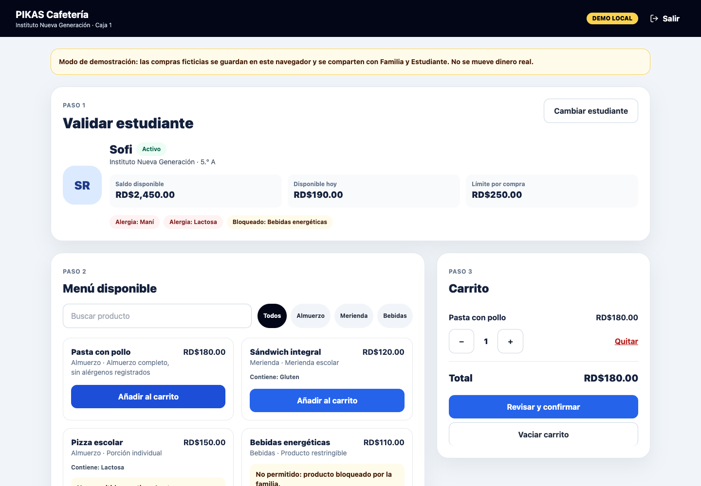

6. Pulsa **Revisar y confirmar**. En el diálogo **Confirmar compra**, revisa estudiante, artículos y total; pulsa **Completar compra** una sola vez.

   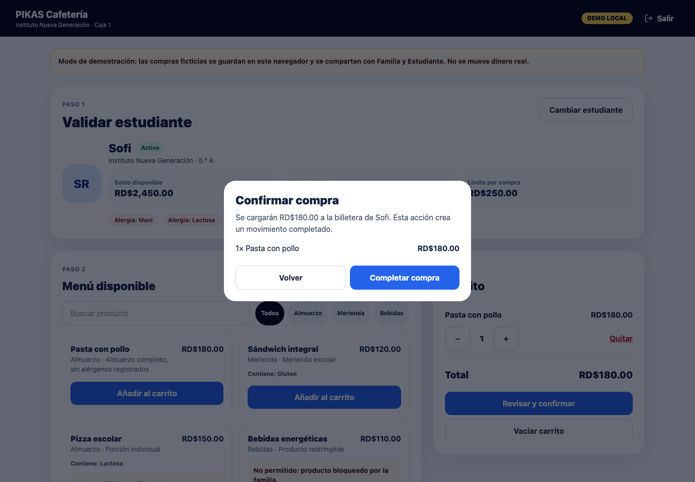

7. Comprueba **Compra completada** y el nuevo registro en **Historial POS**. El detalle conserva producto, total, fecha, caja y estado.

   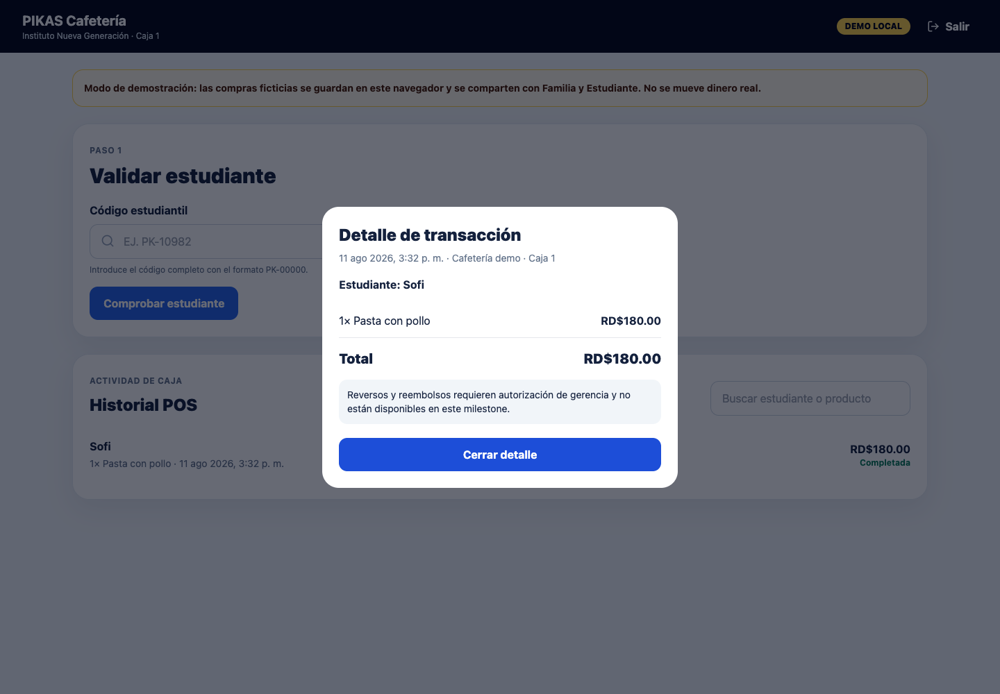

8. Recarga `/pos`: el historial debe conservar la compra, aunque la selección de estudiante y el recibo abierto se reinician. Luego cambia a Estudiante y Familia en el mismo perfil para encontrar el movimiento mostrado en las secciones anteriores.

   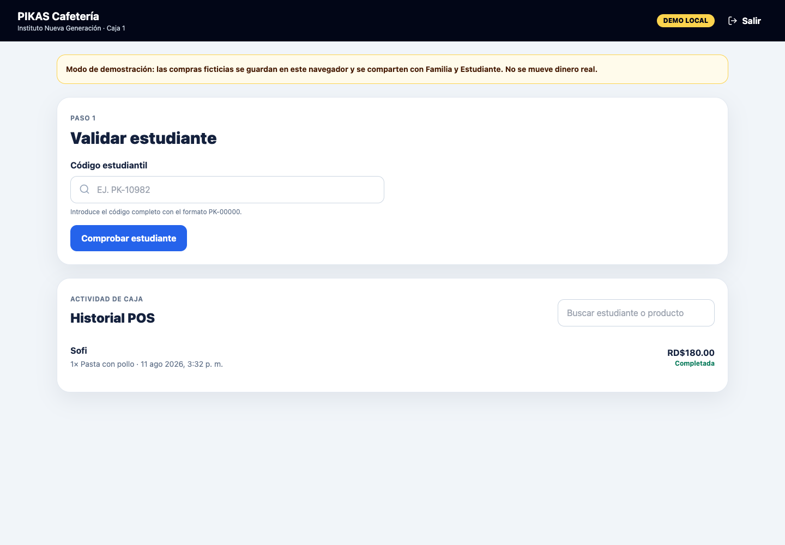

La operación persiste solo en el almacenamiento local de este navegador. No llega a Supabase, otro dispositivo ni el sitio público.

## 7. Cambio entre roles

1. Usa **Cerrar sesión** en Familia/Estudiante o **Salir** en POS; vuelve a `/login` y elige el rol siguiente.
2. Para demostrar una transacción compartida, conserva la misma pestaña o perfil normal. Una pestaña adicional del mismo perfil comparte `localStorage`, pero puede conservar una cookie de rol obsoleta hasta recargar.
3. Evita ventanas privadas o perfiles distintos para el recorrido cruzado: aíslan la compra. Sí pueden servir para una comparación visual independiente, pero empiezan con otro estado.
4. Los guards redirigen cada sesión a su propia experiencia. Para verificarlo, con Familia o Estudiante autenticado abre manualmente `/pos`: debe volver al dashboard autorizado con un aviso. Una sesión POS tampoco puede entrar a `/familias` o `/estudiante`.
5. Si ves el rol equivocado, cierra sesión desde la interfaz. Si persiste, borra las cookies del origen además de reiniciar el estado demo.

## 8. Reinicio y repetibilidad del demo

El flujo de desarrollo soportado para volver a los fixtures iniciales es limpiar la clave versionada del demo. En las herramientas del navegador, abre la consola para `http://localhost:3000` y ejecuta:

```js
localStorage.removeItem("pikas:unified-demo:v2");
location.reload();
```

- Solo afecta el origen y perfil actuales; no borra datos de otros sitios.
- No hay un botón global visible de reinicio. **Recarga demo** añade saldo y no restablece el sistema.
- Refrescar normalmente conserva compras y cambios. Reiniciar el servidor no limpia `localStorage`.
- Si una presentación anterior cambió el saldo, controles o catálogo, aplica el reinicio antes de entrar. Después, Sofi comienza con RD$2,450, RD$350 de límite diario y RD$160 gastados hoy.
- Para limpiar también una sesión de rol atascada, cierra sesión o borra las cookies de `localhost:3000`; la clave anterior controla los datos, no la cookie.

## 9. Solución de problemas

| Problema | Causa probable | Resolución |
| --- | --- | --- |
| Código estudiantil inválido | Error de formato, código desconocido o estudiante inactivo | Usa exactamente `PK-10982` o `PK-11804`; `PK-00000` debe fallar. |
| La cuenta abre un rol inesperado | Demo mode solo selecciona rol o quedó una cookie anterior | Pulsa **Cerrar sesión**/**Salir**, vuelve a `/login` y selecciona la pestaña correcta. |
| La transacción no aparece después del checkout | Checkout no se completó o se cambió de perfil/origen | Confirma **Compra completada**, usa el mismo perfil y abre `/estudiante/transacciones` o `/familias/transacciones`. |
| El saldo parece anterior | La vista quedó abierta antes de la compra | Navega de nuevo a Inicio o recarga en el mismo perfil. |
| Datos alterados por otro presentador | `localStorage` conserva cambios entre recargas | Ejecuta el reinicio de la sección 8. |
| `/pos` devuelve no autorizado | La cookie pertenece a Familia/Estudiante o demo mode está apagado | Cierra sesión, habilita demo mode local e inicia como Cafetería. |
| El preview no abre | El preview puede estar protegido por autenticación de Vercel | Usa `http://localhost:3000` o solicita acceso al equipo. |
| Producción no muestra el refinamiento 0.3.0 | El árbol local no fue desplegado por esta tarea | Presenta local desde esta rama; el POS público sigue siendo funcional. |
| Una imagen no aparece en GitHub | Ruta/capitalización incorrecta o archivo no incluido | Verifica que `docs/assets/demo-guide/<archivo>.png` exista y que el enlace sea relativo a `docs/DEMO_GUIDE.md`. |

## 10. Limitaciones conocidas

| Ámbito | Estado verificado |
| --- | --- |
| Demo funcional | Familia, Estudiante y POS comparten datos ficticios en el mismo navegador; checkout, restricciones, saldo e historial funcionan y persisten al refrescar. |
| Local | Entorno usado para las capturas y el recorrido completo. Requiere `NEXT_PUBLIC_PIKAS_DEMO_MODE=true`. |
| Preview | Puede estar protegido por Vercel Authentication; no se usó como fuente de capturas 0.3.0. |
| Producción | URL pública funcional en demo mode, anterior a los refinamientos locales 0.3.0. |
| Autenticación | Cookie demo por rol; no valida contraseñas ni PIN con una identidad real y no es apta para producción. |
| Supabase | Migraciones, RPC y adaptadores están preparados, pero no conectados ni probados contra un proyecto vivo. |
| Administración | Sin experiencia demo; `/admin` es un placeholder. |
| Identificación | QR es visual; no hay lectura QR ni búsqueda POS por nombre. |
| Operaciones posteriores | No hay cancelación de compras completadas, reversos, refunds ni conciliación. |

Tampoco hay pagos reales, integración SIS, sincronización entre dispositivos ni pruebas live de correo de recuperación, Storage privado, Auth/RLS o concurrencia PostgreSQL.

## 11. Checklist del presentador

- [ ] Abre la URL local correcta y muestra el POS funcional.
- [ ] Las tres credenciales demo funcionan.
- [ ] `PK-10982` resuelve a Sofi y `PK-00000` se rechaza.
- [ ] Pasta con pollo puede añadirse; Pizza escolar y Bebidas energéticas no.
- [ ] El saldo inicial es conocido o el demo fue reiniciado.
- [ ] Las vistas Familia y Estudiante están listas en el mismo perfil.
- [ ] Notificaciones, pestañas personales y herramientas de desarrollo están cerradas.
- [ ] Las capturas en `docs/assets/demo-guide/` están disponibles como respaldo.
- [ ] Si se usará un preview futuro, hay internet y el acceso Vercel fue probado.

---

**Mantenimiento:** revisa esta guía cuando cambien rutas, autenticación, credenciales, códigos estudiantiles, navegación, etiquetas de botones, flujo POS, capturas, URLs de producción/preview o persistencia demo. Actualiza también la fecha, el SHA y las imágenes cuando corresponda.
